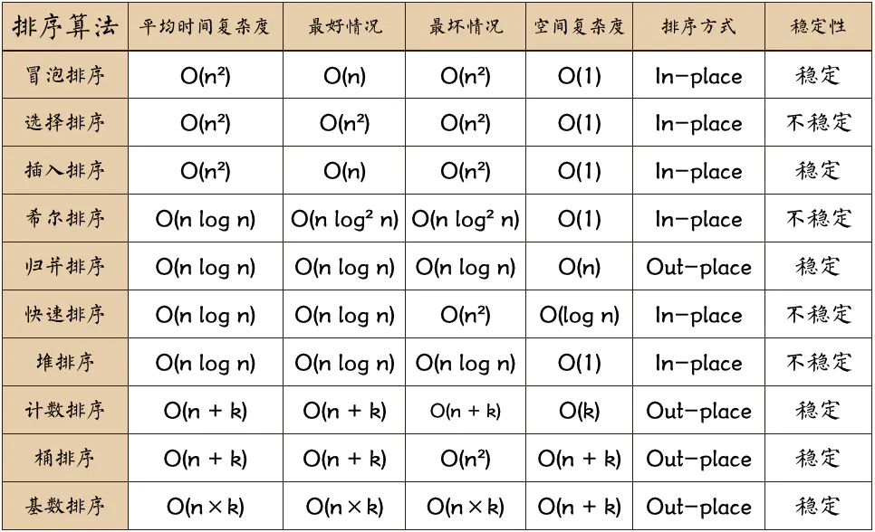
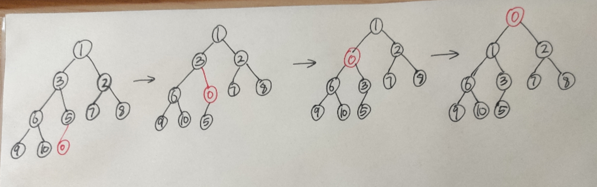
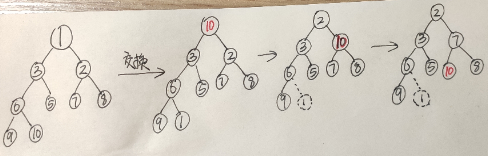
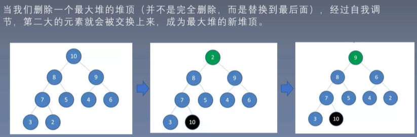

1. [排序算法性能对比图](#排序算法性能对比图)

2. [快速排序](#快速排序)
   1. [快速排序之交换法](#快速排序之交换法)
   2. [三向切分快速排序](#快速排序之三向切分快速排序)
   3. [荷兰国旗问题](#快速排序之荷兰国旗问题)
   4. [数组中的第K个最大元素](#快速排序之数组中的第K个最大元素)
   
3. [堆排序](#堆排序)

    1. [堆排序](#堆排序法)

    2.  [数组中的第K个最大元素](#堆排序-数组中的第K个最大元素)

4. [冒泡排序](#)
    1. [单向冒泡](#单向冒泡)
    2. [双向冒泡](#双向冒泡)

5. [选择排序](#选择排序)

6. [插入排序](#插入排序)

7. [归并排序](#归并排序)
    1. [自顶向下](#归并排序之自顶向下)
    2. [自底向上](#归并排序之自底向上)

8. [计数排序](#计数排序)

9. [桶排序](#桶排序])

10. [基数排序](#基数排序])

11. [希尔排序](#希尔排序)


# 1 排序算法性能对比图<a id="排序算法性能对比图"></a>




# 2 快速排序<a id="快速排序"></a>


## 912. 排序数组 --快速排序之交换法 <a id="快速排序之交换法"></a>

平均时间复杂度: O(n*logn)

最好情况:  O(n*logn)

最坏情况:  O(n*n)   (如果数据已经有序，则需要打乱，防止出现这种情况)

空间复杂度:  O(logn) ?

排序方式:  in-place

稳定性:  不稳定

```python
import random
class Solution:
    def sortArray(self, nums: List[int]) -> List[int]:
		random.shuffle(nums)

        self.quictSort(nums,0,len(nums)-1)
        return nums

    
    def quictSort(self,nums,left,right):
        if left >= right:
            return
        # 每执行一次partition函数，就固定一个元素的位置
        index = self.partition(nums,left,right)
        self.quictSort(nums,left,index-1)
        self.quictSort(nums,index+1,right)

    def partition(self,nums,left,right):
        p = left + 1
        q = right
        tmp = nums[left]
        while(p<=q):
            # nums[p] < tmp 改为 nums[p] > tmp
            # nums[q] > tmp 改为 nums[q] < tmp
            # 则结果返回的为降序
            
            # 从左右两边向中间推进的时候，遇到不符合的数就两边交换值
            while(p<=q and nums[p] < tmp): p += 1
            while(p<=q and nums[q] > tmp): q -= 1
            if (p<=q):
                nums[p], nums[q] = nums[q], nums[p]
                # 交换后左右两边各向中间推进一位
                p += 1
                q -= 1
            
        nums[left], nums[q] = nums[q], nums[left]
        return  q
```


##  三向切分快速排序<a id="快速排序之三向切分快速排序"></a>

`lt  `初始化为` left`

`gt` 初始化为 `right`

` i` 初始化为`left + 1`

`v `初始化为 `nums[left]`

从左到右遍历数组一次，使得`nums[left...lt-1]`中的元素都小于v,  `nums[gt+1...left]`中的元素都大于 v，

`nums[lt...i-1]`中的元素都等于于v,  `nums[i...gt]`中的元素都还为确定。

遍历过程中，将nums[i] 和 v 的值进行比较，有三种情况：

- `nums[i]  < v`，`nums[lt] `和 `nums[i]` 交换，将lt 和 i 加一
- `nums[i]  > v`，`nums[gt] `和 `nums[i] `交换，将gt 减一
- `nums[i]  == v`，将 i 加一


```python
class Solution:
    def sortArray(self, nums: List[int]) -> List[int]:
        self.quict3way(nums,0,len(nums)-1)
        return nums

    
    def quict3way(self,nums,left,right):
        if left >= right:
            return
        v = nums[left]
        lt = left
        i = left + 1
        gt = right
        while(i <= gt):
            diff = nums[i] - v
            if diff < 0:
                nums[lt], nums[i] = nums[i], nums[lt]
                lt += 1
                i += 1
            elif diff > 0:
                nums[i], nums[gt] = nums[gt], nums[i]
                gt -= 1
            else:
                i += 1
			# 现在 nums[left..lt-1] < v = nums[lt..gt] < nums[gt+1..right]
			# 这样能够将和切分元素相等的元素归位，它们就不会被包含在递归调用处理的子数组之中了。
        self.quict3way(nums,left,lt-1)
        self.quict3way(nums,gt+1,right)
```


## 75. 颜色分类 荷兰国旗问题	<a id="快速排序之荷兰国旗问题"></a>  

荷兰国旗包含3中颜色：红、白、蓝
算法的目标是将这三种球按颜色顺序正确地排序，它其实是三向切分快速排序的一种变种，
 在三向切分快速排序中，每次切分都将数组分成3个区间：小于切分元素、等于切分元素、大于切分元素，
而该算法是将数组分成3个区间：等于红色、等于白色、等于蓝色。

```python

class Solution:
    def sortColors(self, nums: List[int]) -> None:
        """
        Do not return anything, modify nums in-place instead.
        """
        v = 1
        lt = 0
        i = 0
        gt = len(nums) - 1
        while(i <= gt):
            diff = nums[i] - v
            if diff < 0:
                nums[lt], nums[i] = nums[i], nums[lt]
                lt += 1
                i += 1
            elif diff > 0:
                nums[i], nums[gt] = nums[gt], nums[i]
                gt -= 1
            else:
                i += 1
```


 ## 215. 数组中的第K个最大元素<a id="快速排序之数组中的第K个最大元素"></a>

```python
class Solution:
    def findKthLargest(self, nums: List[int], k: int) -> int:
        n = len(nums)
        if k > n:
            return max(nums)
        import random
        random.shuffle(nums)
        
        return self.select(nums,n-k)
    
    def select(self,nums,k):
        print(k)
        left = 0
        right = len(nums) - 1
        while(right > left):
            index = self.partition(nums,left,right)
            print(index,nums)
            if index < k:
                # 在右半边寻找，缩小查找空间
                left = index + 1
            elif index > k:
                # 在左半边寻找，缩小查找空间
                right = index - 1
            else:
                break
        return nums[k]


    def partition(self,nums,left,right):
        p = left + 1
        q = right
        tmp = nums[left]
        while(p<=q):
            while(p<=q and nums[p] < tmp):p += 1
            while(p<=q and nums[q] > tmp): q -= 1
            if (p<=q):
                nums[p], nums[q] = nums[q], nums[p]
                p += 1
                q -= 1
        nums[left],nums[q] = nums[q], nums[left]
        return q
```


# 3 堆排序<a id="堆排序"></a>

## 堆排序法<a id="堆排序法"></a>

二叉堆本质上是一个种完全二叉树，分为两个类型：

1. 最大堆：最大堆任何一个父节点的值，都大于等于它左右孩子节点的值。

2. 最小堆： 最小堆任何一个父节点的值，都小于等于它左右孩子节点的值。

二叉堆的存储为顺序存储，节点都**存储在数组中**。

`节点i` 的左孩子为`2*i + 1`, 右孩子为` 2*i +2`, 父节点为`(i-1)//2`

二叉堆的根节点叫做**堆顶**。最大堆的**堆顶**是整个堆中的**最大元素**；最小堆的堆顶是整个堆中的**最小元素**。

**插入节点**，以最小堆为例（在末尾进行插入）




**删除节点**，一般是弹出堆顶元素（最大值或最小值）




**堆排序**



```python
class Solution:
    def sortArray(self, nums: List[int]) -> List[int]:

        self.buildHeap(nums)

        for i in range(len(nums)-1,-1,-1):
            # 第一个元素 和 最后一个元素 进行交换
            nums[i],nums[0] = nums[0],nums[i]
            # 排除最后一个元素
            self.max_heapify(nums,0,i)
        return nums


    def buildHeap(self,nums):
        # 构建二叉堆，就是把一个无序的完全二叉树调整为二叉堆，本质上是让所有非叶子节点依次下层。自下而上的调整。
        n = len(nums)
        for i in range((n-1)//2,-1,-1):
            # 从最后一个节点的父节点向上调整
            self.max_heapify(nums,i,n)


    def max_heapify(self,nums,i,length):
        left = 2*i + 1
        right = 2*i + 2
        largest = i
        if left < length and nums[i] < nums[left]:
            largest = left
        if right < length and nums[largest] < nums[right]:
            largest = right
        if largest != i:
            nums[largest], nums[i] = nums[i],nums[largest]
            # 如果交换了，还需要检查largest的子树是否符合二叉堆定义。
            self.max_heapify(nums,largest,length)
```


## 堆排序-数组中的第K个最大元素<a id="堆排序-数组中的第K个最大元素"></a>

与原始堆排序的唯一区别是，从堆顶交换到尾部的次数，此时次数为K次，就可以结束了。

```python
class Solution:
    def findKthLargest(self, nums: List[int], k: int) -> int:
        self.build_heap(nums)
        n = len(nums)
        for i in range(n-1, n-1-k, -1):
            # 只需要交换K次，就可以把第K大的元素返回
			# 第一个元素和最后一个元素交换
            nums[i],nums[0] = nums[0], nums[i]
			# 排除最后一个元素
            self.max_heapify(nums,0,i)
        return nums[-k]
    
    def build_heap(self,nums):
        length = len(nums)
        for i in range((length-1)//2, -1, -1):
            #从最后一个节点的父节点开始向上调整
            self.max_heapify(nums,i,length)

    def max_heapify(self,nums,i,length):
        largest = i
        left = i * 2 + 1
        right = i*2 + 2
        if left < length and nums[left] > nums[i]:
            largest = left

        if right < length and nums[right] > nums[largest]:
            largest = right

        if largest != i:
            nums[i], nums[largest] = nums[largest], nums[i]
            self.max_heapify(nums,largest,length)
```


# 4 冒泡排序<a id="冒泡排序"></a>

## 单向冒泡<a id="单向冒泡"></a>

- 最好：`O(n)`，只需要冒泡一次数组就有序了。
- 最坏：`O(n²)`
- 平均：`O(n²)`


通过相邻元素的比较和交换，使得每一趟循环都能找到未有序数组的最大值或最小值。

```python
class Solution:
    def sortArray(self, nums: List[int]) -> List[int]:
        n = len(nums)
        for i in range(0,n-1):
            # 如果在一趟排序中没有需要交换的元素，则说明数组已经有序。
            # 主要是对[5,1,2,3,4]之类的数组进行优化
			# 经过n-1趟冒泡，把最大的放到数组末端
            mark = True
            # i 表示已经排好序列的个数，所以只需要循环n-1-i次
            for j in range(0,n-i-1):
                if nums[j] > nums[j+1]:
                    nums[j],nums[j+1] = nums[j+1],nums[j]
                    mark = False
            if mark:
                return nums
        return nums
```


## 双向冒泡<a id="双向冒泡"></a>

普通的冒泡排序在一趟循环中只能找出一个最大值或最小值，双向冒泡则是多一轮循环既找出最大值也找出最小值。


```python
class Solution:
    def sortArray(self, nums: List[int]) -> List[int]:
        low = 0
        high = len(nums) - 1
        while low < high:
            mark = True
			# 找到最大值放到右边
            for i in range(low,high,1):
                if nums[i] > nums[i+1]:
                    nums[i],nums[i+1] = nums[i+1],nums[i]
                    mark = False
            high -= 1

			# 找到最小值放到左边
            for j in range(high,low,-1):
                if nums[j] < nums[j-1]:
                    nums[j],nums[j-1] = nums[j-1],nums[j]
                    mark = False
            low += 1

            if mark:
                return nums
        return nums
```


# 5 选择排序<a id="选择排序"></a>

和冒泡排序相似，区别在于选择排序是将每一个元素和它后面的元素进行比较和交换，使得nums[i]一直维持最小。

- 最好：`O(n²)`

- 最坏：`O(n²)`

- 平均：`O(n²)`

  ```python
  class Solution:
      def sortArray(self, nums: List[int]) -> List[int]:
          n = len(nums)
          for i in range(0,n,1):
              for j in range(i+1,n,1):
  			# 将nums[i] 和它后面的元素进行比较，使nums[i] 一直维持最小
                  if nums[i] > nums[j]:
                      nums[i], nums[j] = nums[j], nums[i]
          return nums
  
  ```

  

# 6 插入排序<a id="插入排序"></a>

以第一个元素作为有序数组，其后的元素通过在这个已有序的数组中找到合适的位置并插入。

- 最好：`O(n)`，原数组已经是升序的。
- 最坏：`O(n²)`
- 平均：`O(n²)`


```python
class Solution:
    def sortArray(self, nums: List[int]) -> List[int]:
        N = len(nums)
        for i in range(1,N):
            j = i
            while(j>0 and nums[j]<nums[j-1]):
                nums[j],nums[j-1] = nums[j-1], nums[j]
                j -= 1

        return nums
```


# 7 归并排序<a id="归并排序"></a>

递归将数组平分为两个序列，并有序合并这两个序列。

- 最好：`O(n * logn)`

- 最坏：`O(n * logn)`

- 平均：`O(n * logn)`

- 空间复杂度：`O(N)`

- 排序方式： out-place

- 稳定性：稳定

  

  


## 自顶向下<a id="归并排序之自顶向下"></a>

```python
class Solution:
    def sortArray(self, nums: List[int]) -> List[int]:
		# 在排序前，先建立好一个长度等于原数组长度的临时辅助数组，避免递归中频繁开辟空间
        aux = [0] * len(nums)
        self.sort(nums,0,len(nums)-1,aux)
        return nums
    
    def sort(self,nums,lo,hi,aux):
        if hi <= lo: return
        mid = lo + (hi-lo)//2
        self.sort(nums,lo,mid, aux) # 左边归并排序，使得左子序列有序
        self.sort(nums,mid+1,hi, aux) # 右边归并排序，使得右子序列有序
        self.merge(nums, lo, mid, hi, aux) # 将两个有序子数组合并排序

    def merge(self, nums, lo, mid, hi, aux):
        i = lo # 左序列头指针
        j = mid+1 # 右序列头指针
		
		# 将原数组复制到辅助数组
        for k in range(lo,hi+1):
            aux[k] = nums[k]

        for k in range(lo,hi+1):
            if i > mid:  # 将右边剩余元素放到nums中
                nums[k] = aux[j]
                j += 1
            elif j > hi: # 将左边剩余元素放到nums中
                nums[k] = aux[i]
                i += 1
            elif aux[i] > aux[j]:
                nums[k] = aux[j]
                j += 1
            else:
                nums[k] = aux[i]
                i += 1
```


## 自底向上<a id="归并排序之自底向上"></a>

```python
class Solution:
    def sortArray(self, nums: List[int]) -> List[int]: 
        aux = [0] * len(nums)
        N = len(nums)
        for sz in [2**i for i in range(N) if 2**i < N]:
            for lo in range(0, N-sz, 2*sz):
                self.merge(nums,lo,lo+sz-1,min(lo+sz+sz-1,N-1),aux)
        return nums

    def merge(self,nums,lo,mid,hi,aux):
        i = lo
        j = mid + 1
        for k in range(lo,hi+1):
            aux[k] = nums[k]
        
        for k in range(lo,hi+1):
            if i > mid:
                nums[k] = aux[j]
                j += 1
            elif j > hi:
                nums[k] = aux[i]
                i += 1
            elif aux[i] > aux[j]:
                nums[k] = aux[j]
                j += 1
            else:
                nums[k] = aux[i]
                i += 1
```

```python
sz = 1
	 merge(0,0,1)
	 merge(2,2,3)
	 merge(4,4,5)
	 merge(6,6,7)
	 merge(8,8,9)
	 merge(10,10,11)
	 merge(12,12,13)
	 merge(14,14,15)
sz = 2
	 merge(0,1,3)
	 merge(4,5,7)
	 merge(8,9,11)
	 merge(12,13,15)
sz = 4
	 merge(0,3,7)
	 merge(8,11,15)
sz = 8
	 merge(0,7,15)
```


# 8 计数排序<a id="计数排序"></a>

计数排序的核心在于将输入的数据值转为化键存储在额外开辟的数组空间中。

作为一种线性时间复杂度的排序，计数排序要求输入的数据必须是有确定范围的正整数。


```python
def counting_sort(nums):
    max_v = max(nums)
    min_v = min(nums)
    n = max_v - min_v + 1
    
    # 桶的大小
    arr = [0 for _ in range(n)]
    
    # 装桶
    for i in range(len(nums)):
        tmp = nums[i]
        arr[tmp-min_v] += 1 # 注意需要减去最小值
    
    index = 0
    # 还原原数组
    for i in range(n):
        while(arr[i]>0):
            nums[index] = i + min_v # 注意需要加上最小值
            index += 1
            arr[i] -= 1
    return nums
```


# 9 桶排序<a id="桶排序"></a>

取n个桶，根据数组的最大值和最小值确认每个桶存放的树的区间，将数组元素插入到相应的桶里，最后再合并各个桶。

- 最好：`O(n)`, 每个数都分布在一个桶里，这样就不用将数插入排序到桶里了（类似于计数排序以空间换时间）

- 最坏：`O(n²)`, 所有的数都分布在一个桶里。

- 平均：`O(n + k)`,k表示桶的个数。

  ```python
  def bucketSort(nums):
      max_v = max(nums)
      min_v = min(nums)
      # 桶的个数
      num = 3
      
      # 计算每个桶存放的数值范围，至少为1
      range_v = (max_v - min_v)//num + 1
      
      # 创建一个二维数组，第一维表示第几个桶，第二维表示该桶内存放的数
      arr = [[] for _ in range(num)]
      
      for v in nums:
          # 计算元素应该分布在哪个桶
          index = (v - min_v) // range_v
          
          # 将该元素附加到这个桶的尾部
          arr[index].append(v)
          
          # 使用插入排序将这个尾部元素插入到适当的位置
          sub_arr = arr[index]
          j = len(sub_arr) - 1
          while(j >0 and sub_arr[j] < sub_arr[j-1]):
              sub_arr[j], sub_arr[j-1] = sub_arr[j-1], sub_arr[j]
              j -= 1
        
      # 将二维数组展开
      res = []
      for item in arr:
          res.extend(item)
      return res
  ```

  

# 10 基数排序<a id="基数排序"></a>

https://www.cnblogs.com/sun/archive/2008/06/26/1230095.html

- 最好：`O(n * k)`，k表示最大值的位数。

- 最坏：`O(n * k)`

- 平均：`O(n * k)`

  

基数排序是非比较排序算法，算法的时间复杂度为O(n*k). 相比于快速排序O(nlogn)，从表面上看具有不小的优势，但事实上可能有些出入，因为基排序的中的k可能比较大。因此在具体应用中，需要对这个排序函数的效率进行评估。

**思路：**

- 将所有待比较数值（必须是正整数）统一为同样的数位长度，数位较短的数前面补零。
- 从低位开始，依次进行一次**稳定排序**（可以使用计数排序算法，因为每位的取值范围为0到9）
- 从最低位排序一直到最高位排序完成后，数列就是后序序列了

比如有这样一个数列排序：342     58     576    356， 以下描述演示了具体的排序过程（红色字体表示正在排序的数位）

第一次排序（个位）

3 4 <font color=red >**2**</font>

5 7 <font color=red >**6**</font>

3 5 <font color=red >**6**</font>

0 5 <font color=red >**8**</font>

第二次排序（十位）

3 <font color=red >**4**</font> 2 

3 <font color=red >**5**</font> 6

0 <font color=red >**5**</font> 8 

5 <font color=red >**7**</font> 6 


第三次排序（白位）
<font color=red >**0**</font> 5  8 

<font color=red >**3**</font> 4  2 

<font color=red >**3**</font> 5  5 

<font color=red >**5**</font> 7  6 

结果： 58   342     356    576

**两位问题：**

- 为什么要从低位开始向高位排序？

   如果要从高位排序，那么次高位的排序会影响高位已经排好的大小关系。在数学中，数位越高对数的大小的影响就越大。 从低位开始排序，就是对这种影响的排序。 数位按照影响力从低到高的顺序排序，数位影响力相同则比较数位数值。

- 为什么同一数位的排序子程序要使用稳定排序？

    稳定排序的意思是指，待排序相同元素之间的相对前后关系，在各次排序中不会改变。比如实例中具有十位数字5的两个数组58 和 356，在十位排序之前365 和 58 之前，在十位排序之后，365 依然在 58 之前。

   ​      稳定排序能保证，上一次的排序成果被保留，十位数的排序过程能保留个位数的排序成果，百位数的排序过程能保留十位数的排序成果。

```python
def radixSort(nums):
    # 计算位数
    max_v = max(nums)
    n = 0
    while(max_v):
        n += 1
        max_v //= 10
        
    # 进行几轮排序
    for k in range(n):
        # 使用计数排序法对位进行排序 10个桶
        arr = [[] for _ in range(10)]
        for v in nums:
            arr[v // (10**k) % 10].append(v) # 将数字进行分配到各个相应的桶中
        nums = [j for i in arr for j in i] # 将十个桶整合成一个列表，方便下次进行排序
    return nums   
```


# 11 希尔排序<a id="希尔排序"></a>

希尔排序，也称递减增量排序算法，是插入排序的一种高效的改进版本。但是希尔排序是非稳定排序。

希尔排序是基于插入排序的以下两点性质而提出的改进方法的：

- 插入排序在对几乎排好序的数据操作时，效率高，即可以达到线性排序的效率；

- 但插入排序一般来说是低效的，因为插入排序每次只能将数据移动一位。

希尔排序在数组中采用跳跃式分组的策略，通过某个增量将数组元素划分为若干个组，然后分组进行插入排序，随后逐步缩小增量，继续按组进行插入排序操作，直至增量为1.

希尔排序通过这种策略使得整个数组在初始阶段达到从宏观上看基本有序，小的基本在前，大的基本在后。然后缩小增量，到增量为1时，其实多数情况下只需要微调即可，不会涉及过多的数据移动。

一般使用希尔增量`{n/2,(n/2)/2...1}`。


  

```python
def shellSort(nums):
    gap = len(nums) // 2
    while gap:
        for i in range(gap, len(nums)):
            j = i
            while(j-gap>=0 and nums[j] < nums[j-gap]):
                nums[j], nums[j-gap] = nums[j-gap], nums[j]
                j -= gap
        gap //= 2
    return nums
```

